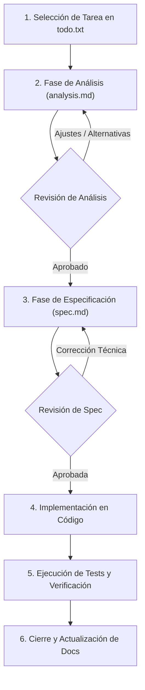

# Flujo de Trabajo y Reglas SDD (Spec-Driven Development)

Este documento establece las directrices, reglas de oro y el ciclo de vida obligatorio para cualquier incorporación de funcionalidad o cambio estructural en **Weather App**.

---

## 1. Principios Fundamentales

1. **Cero Código sin Especificación Aprobada**: No se debe modificar código fuente de producción (`src/`) sin que exista previamente un documento de análisis (`analysis.md`) y una especificación técnica (`spec.md`) validados y aprobados.
2. **Determinismo**: La especificación técnica debe ser tan precisa que cualquier desarrollador (o agente) que la lea llegue a la misma implementación exacta.
3. **Contratos Explícitos**: Toda interfaz de datos, props de componentes, firmas de servicios o eventos deben quedar tipados y documentados en la spec.
4. **Testing por Diseño**: Cada funcionalidad debe nacer con sus criterios de aceptación en formato *Given-When-Then* y sus tests automatizados planificados antes de comenzar la codificación.

---

## 2. Ciclo de Vida de una Funcionalidad



---

## 3. Guía Paso a Paso

### Paso 1: Creación del Espacio de Trabajo de la Feature
Se crea una carpeta dentro de `docs/features/` siguiendo la convención de nomenclatura:
`docs/features/[ID_3_DIGITOS]-[slug-de-la-funcionalidad]/`

*Ejemplo:* `docs/features/001-share-and-clipboard/`

---

### Paso 2: Fase de Análisis (`analysis.md`)
- Se copia la plantilla [ANALYSIS_TEMPLATE.md](../templates/ANALYSIS_TEMPLATE.md) en `docs/features/XXX-.../analysis.md`.
- Se documenta el contexto, el problema que resuelve, las necesidades del usuario y las alternativas técnicas evaluadas.
- Se identifican trade-offs (ventajas vs desventajas) y preguntas abiertas que requieran decisión.
- **Punto de Control**: Se somete a revisión y se obtienen acuerdos antes de diseñar la solución técnica.

---

### Paso 3: Fase de Especificación Técnica (`spec.md`)
- Se copia la plantilla [SPEC_TEMPLATE.md](../templates/SPEC_TEMPLATE.md) en `docs/features/XXX-.../spec.md`.
- Se define la arquitectura:
  - Nuevos componentes y jerarquía.
  - Tipos de datos, interfaces y DTOs.
  - Casos borde y manejo de errores exhaustivo.
  - Lista exacta de archivos a crear (`[NEW]`), modificar (`[MODIFY]`) o eliminar (`[DELETE]`).
  - Plan de tests unitarios (Vitest) y criterios de aceptación Gherkin (*Given-When-Then*).
- **Punto de Control**: Se solicita la aprobación formal de la especificación.

---

### Paso 4: Implementación
- Se codifica respetando estrictamente los archivos, contratos y componentes definidos en `spec.md`.
- Si durante la implementación surge un imprevisto que altera el diseño, se actualiza la `spec.md` primero.

---

### Paso 5: Verificación Automatizada y Manual
- Se ejecutan los tests unitarios con Vitest:
  ```powershell
  npm test
  ```
- Se valida la compilación de producción con Vite:
  ```powershell
  npm run build
  ```
- Se comprueba cada criterio de aceptación definido en la spec.

---

### Paso 6: Cierre y Actualización de Estado
- Se actualiza el estado de la funcionalidad en [docs/README.md](../README.md) a `Completada`.
- Se marca la tarea como realizada en `todo.txt`.
