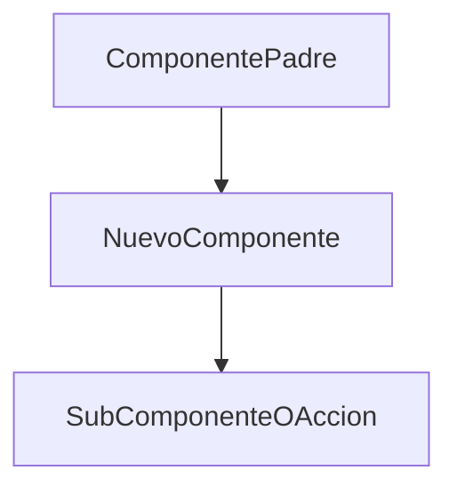

# Especificación Técnica Determinista (Spec / SDD)

| Metadato | Detalle |
| :--- | :--- |
| **ID Funcionalidad** | `XXX` |
| **Título** | `[Nombre corto y descriptivo]` |
| **Documento de Análisis Asociado** | `[analysis.md](./analysis.md)` |
| **Fecha de Creación** | `AAAA-MM-DD` |
| **Estado** | `Borrador` \| `En Revisión` \| `Aprobado` \| `Implementado` |

---

## 1. Alcance y Objetivos Técnicos

### 1.1 En Alcance
- [ ] Objetivo técnico 1
- [ ] Objetivo técnico 2

### 1.2 Fuera de Alcance
- Elementos expresamente excluidos de esta iteración.

---

## 2. Contratos de Datos e Interfaces

Definición formal de tipos, interfaces de JavaScript/TypeScript, payloads o firmas de funciones:

```typescript
// Ejemplo de Contrato de Datos o Props
export interface MiNuevaFeatureProps {
  prop1: string;
  onAction: (id: string) => Promise<void>;
}
```

---

## 3. Arquitectura y Jerarquía de Componentes

Diagrama de flujo o estructura de componentes involucrados:



### 3.1 Detalle de Componentes / Módulos
- **`ComponenteX`**: Responsabilidad, estados internos (`useState`), efectos (`useEffect`) y eventos.

---

## 4. Manejo de Errores y Casos Borde

| Escenario / Caso Borde | Comportamiento Esperado | Manejo Técnico |
| :--- | :--- | :--- |
| `Ejemplo: Usuario sin permisos de portapapeles` | Notificar al usuario con fallback visual | Capturar excepción en `navigator.clipboard` |
| `Ejemplo: Texto vacío` | Deshabilitar botón de acción | Validación previa con estado disabled |

---

## 5. Plan Detallado de Cambios en Archivos

Listado determinista de todas las modificaciones requeridas en el código:

- `[NEW] src/components/NuevoComponente.jsx`: Componente UI con lógica de interacción.
- `[NEW] src/helpers/helper-nueva-feature.js`: Funciones auxiliares puras.
- `[MODIFY] src/components/ComponenteExistente.jsx`: Integración del nuevo componente.
- `[NEW] src/__tests__/NuevoComponente.test.jsx`: Pruebas de render y eventos.

---

## 6. Estrategia de Testing

### 6.1 Pruebas Unitarias (Vitest)
- Test 1: `Debe renderizar correctamente los elementos iniciales.`
- Test 2: `Debe ejecutar la acción esperada al hacer click.`
- Test 3: `Debe manejar el error de forma segura cuando la API falla.`

---

## 7. Criterios de Aceptación (Gherkin / Given-When-Then)

```gherkin
Escenario: Ejecución exitosa de la funcionalidad
  Dado que el usuario visualiza los datos del clima de una ciudad
  Cuando hace click en el botón de la nueva funcionalidad
  Entonces el sistema realiza la acción esperada
  Y se muestra un mensaje o feedback visual de confirmación.
```
