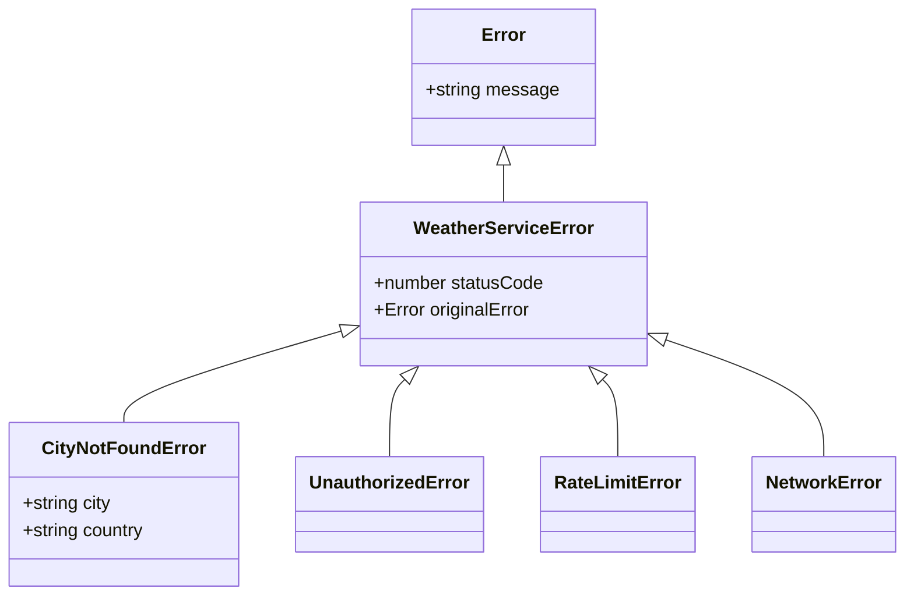

# 04. Arquitectura de Servicios y Manejo de Errores Tipados

## 1. Principio de Responsabilidad Única (SRP) en UI vs Servicios

En el diseño inicial de la aplicación, el componente `App.jsx` realizaba simultáneamente:
- Gestión de estado visual (`loading`, `formData`, `errorSearch`).
- Construcción manual de URLs y parámetros query.
- Ejecución de `fetch` y control de transporte HTTP.
- Desestructuración y transformación de objetos crudos anidados de la API de OpenWeatherMap.

### Beneficios del Desacoplamiento:
1. **Separación de Capas**: Los componentes de React solo se preocupan por **cómo mostrar los datos**, mientras que el servicio se encarga de **cómo obtenerlos y transformarlos**.
2. **Reutilización**: Si mañana se agrega otra vista o widget que consulte el clima, se reutiliza la misma clase `WeatherService` sin duplicar lógica de red.
3. **Mantenibilidad**: Si la API de OpenWeatherMap cambia su endpoint o estructura, solo se modifica el adaptador (`weatherAdapter.js`) sin tocar los componentes.

---

## 2. Patrón Adaptador / DTO (Data Transfer Object)

La API externa devuelve estructuras complejas y poco convenientes (e.g. `data.weather[0].icon`, `data.main.temp_max`).

El adaptador (`src/services/weatherAdapter.js`) actúa como un filtro protector:

```javascript
export function normalizeWeatherResponse(rawData) {
  const { name = '', main = {}, weather = [], wind = {} } = rawData;
  const details = weather[0] || {};

  return {
    name,
    temp: main.temp ?? 0,
    temp_max: main.temp_max ?? 0,
    temp_min: main.temp_min ?? 0,
    feels_like: main.feels_like ?? 0,
    humidity: main.humidity ?? 0,
    pressure: main.pressure ?? 0,
    main: details.main ?? '',
    description: details.description ?? '',
    icon: details.icon ?? '',
    speed: wind.speed ?? 0,
    deg: wind.deg ?? 0,
    gust: wind.gust ?? 0,
  };
}
```

---

## 3. Jerarquía de Errores Tipados Personalizados

En lugar de propagar errores genéricos de JavaScript (`Error('Failed')`) o depender de comparar strings de códigos de error (`if (data.cod === '404')`), se implementa una jerarquía basada en herencia:



### Captura Semántica en Componentes (`instanceof`):

```javascript
try {
  const data = await weatherService.getWeatherByCity(city, country);
  setApiData(data);
} catch (error) {
  if (error instanceof CityNotFoundError) {
    // Ciudad no encontrada -> mostrar mensaje amigable al usuario
    setErrorSearch(true);
  } else if (error instanceof UnauthorizedError) {
    // Problema de configuración / API Key
    console.error('Configuración inválida:', error.message);
  } else if (error instanceof NetworkError) {
    // Error de conexión a internet
    mostrarAlerta('Sin conexión a internet');
  }
}
```

---

## 4. Variables de Entorno en Vite

En proyectos Vite, las variables de entorno para el cliente deben prefijarse con `VITE_` y se leen mediante `import.meta.env`:

```env
# .env (ignorado por Git)
VITE_OPENWEATHER_API_KEY=tu_api_key_aqui
VITE_OPENWEATHER_BASE_URL=https://api.openweathermap.org/data/2.5
```

```javascript
// src/services/index.js
const apiKey = import.meta.env.VITE_OPENWEATHER_API_KEY || '';
const baseUrl = import.meta.env.VITE_OPENWEATHER_BASE_URL || 'https://api.openweathermap.org/data/2.5';
```
